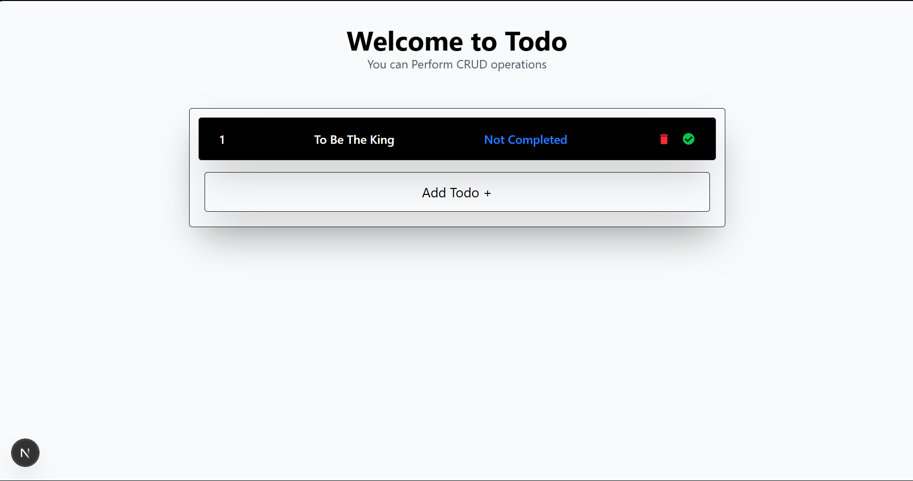

# Awesome Todo App

<!-- Image placeholder: add your screenshot to `public/screenshot.png` to show it here -->


A simple, awesome Todo application — frontend built with Next.js and a backend API powered by Java Spring (Spring Boot).

This repo contains the Next.js frontend. The backend is a Java Spring service that exposes a REST API for managing todos.

What makes this app awesome:

- Clean, fast Next.js frontend (TypeScript + app router)
- Robust Java Spring Boot backend (REST API, persistence-ready)
- Add, edit, delete, and mark tasks complete
- Ready to connect to a database or in-memory store

## Technologies

- Frontend: Next.js, TypeScript, React
- Backend: Java Spring Boot (REST API)
- Backend Url: https://github.com/Nithwin/TodoListJavaSpring.git


## Screenshot / Add an image

To show a screenshot in this README, add an image named `screenshot.png` to the `public/` folder. The file at `public/screenshot.png` will automatically appear above.

If you'd rather use a different image name or path, update the markdown image link at the top of this file.

## Getting started (frontend)

1. Install dependencies:

   ```powershell
   npm install
   ```

2. Run the development server:

   ```powershell
   npm run dev
   ```

   Open http://localhost:3000 in your browser.

## Backend (Java Spring)

This repository contains only the Next.js frontend. If you have the Java Spring backend in a separate folder or repository, start it like this from the backend project root:

```powershell
# using the wrapper (if present)
./mvnw spring-boot:run
# or with Maven installed
mvn spring-boot:run
```

Notes:

- The backend should expose a REST API (e.g. /api/todos) for the frontend to call.
- If your backend runs on a different port, update the frontend service endpoint in `services/todoService.ts`.

## Development tips

- Place a screenshot at `public/screenshot.png` to show it in this README.
- Update `services/todoService.ts` to point to your backend base URL if needed.
- Add environment variables or a proxy if you run frontend and backend on different ports.

## Contributing

Small improvements, bug fixes and screenshots are welcome. Open a PR with a clear description.

## License

Add a license file if you plan to make this repo public.

---

Enjoy building! Add your screenshot to `public/screenshot.png` and this README will show it above.
